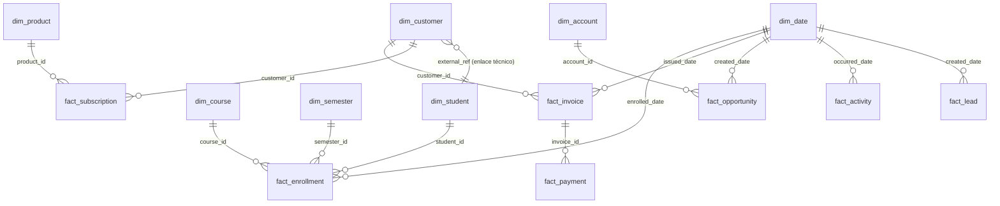

# Modelo Gold — esquema dimensional

Modelo estrella sobre el schema `gold` de PostgreSQL. Dimensiones y hechos son tablas materializadas desde Silver (`sql/gold/load.sql`); los KPIs son vistas (`sql/gold/ddl.sql`).

## Diagrama (hechos y dimensiones)

## Dimensiones

| Dimensión | Grano | Origen Silver | Notas |
|---|---|---|---|
| `dim_date` | 1 día (2005–2027) | generada | Cubre `hired_at` mín y `end_date` máx |
| `dim_student` | estudiante | university_students | Incluye flag `age_at_enrollment_lt_15` |
| `dim_customer` | cliente billing | billing_customers | `is_student` + `student_id` (external_ref) sin merge de PII |
| `dim_product` | producto/plan | billing_products | `monthly_price`, `active` |
| `dim_course` | curso | university_courses | Flag `department_mismatch` |
| `dim_semester` | semestre | university_semesters | La dimensión más limpia del dataset |
| `dim_account` | cuenta CRM | crm_accounts | `employee_band` derivado; `name_is_shared` |

## Hechos

| Hecho | Grano | Filas | Medidas / notas |
|---|---|---|---|
| `fact_enrollment` | inscripción (supervivientes) | 24.977 | `final_score` (renormalizado), `passed` (≥60), `status` |
| `fact_invoice` | factura | 50.000 | `invoiced_amount` = Σ items o `total_reported`; `payment_status_derived` |
| `fact_payment` | pago | 80.000 | `amount` (no usar como revenue), `method` |
| `fact_subscription` | suscripción | 15.000 | `monthly_price`, `is_effectively_expired` |
| `fact_opportunity` | oportunidad | 3.000 | `amount`, `is_won`, `is_closed` |
| `fact_activity` | actividad | 20.000 | `is_orphan`, `account_mismatch` |
| `fact_lead` | lead | 2.000 | `is_converted`, `score` |

## KPIs (vistas)

| Vista | Pregunta de negocio |
|---|---|
| `kpi_revenue_monthly` | Revenue facturado por mes y moneda (sin sumar entre monedas) |
| `kpi_collection_by_currency` | % de facturas cobradas por moneda |
| `kpi_academic_by_department` | Nota promedio y tasa de aprobación por departamento |
| `kpi_subscription_status` | Suscripciones por estado y MRR activo |
| `kpi_sales_pipeline` | Oportunidades y monto por etapa (habilita win rate) |
| `kpi_lead_funnel` | Embudo de leads por estado |
| `kpi_student_vs_external` | Facturación de estudiantes vs. clientes externos |

## Definiciones y convenciones

- **Revenue** = `fact_invoice.invoiced_amount` (Σ `line_total` de items; `total_reported` si la factura no tiene items). **Nunca** se suman montos entre monedas.
- **Cobranza** se mide por `status='paid'`, no por suma de pagos (montos inconsistentes en el origen).
- **Aprobación** académica = `final_score >= 60`.
- **MRR** = Σ `monthly_price` de suscripciones `active` no expiradas efectivamente.
- **Win rate** = won / (won + lost), derivable de `kpi_sales_pipeline`.

Las justificaciones completas están en [`decisiones.md`](./decisiones.md).
